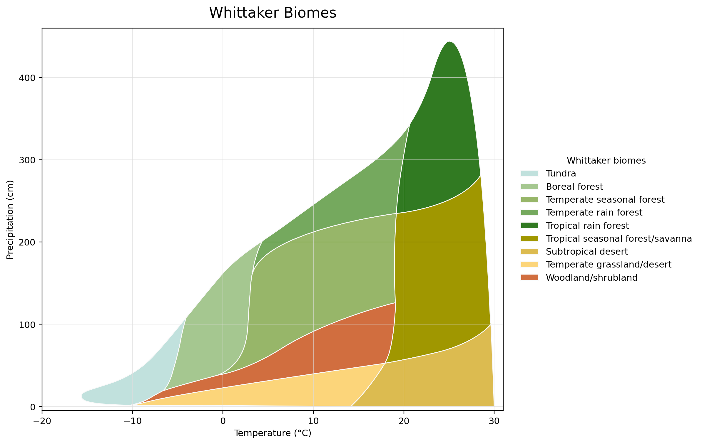

# plotbiomes-python

Python plotting tools for Whittaker biome climate-space polygons.



Included features:

- bundled Whittaker biome vertices
- bundled biome color palette
- `whittaker_base_plot()` for a matplotlib base figure
- `plot_points()` for climate points on the biome figure
- `get_outliers()` and `classify_biomes()` for point-in-polygon checks
- `map_outliers()` for optional folium maps

## Install

From this repository:

```bash
python3 -m pip install -e .
```

Optional extras:

```bash
python3 -m pip install -e ".[dataframe,map]"
```

From GitHub:

```bash
python3 -m pip install git+https://github.com/WJ714/plotbiomes-python.git
```

## Quick Start

```python
import matplotlib.pyplot as plt
import plotbiomes

ax = plotbiomes.whittaker_base_plot()
plotbiomes.plot_points(
    [(-3.0, 80.0), (8.0, 125.0), (35.0, 1000.0)],
    ax=ax,
    base=False,
)
plt.show()
```

## Data

```python
rows = plotbiomes.load_whittaker_biomes()
colors = plotbiomes.load_ricklefs_colors()
polygons = plotbiomes.load_whittaker_polygons()
```

Use pandas output when the `dataframe` extra is installed:

```python
df = plotbiomes.load_whittaker_biomes(as_dataframe=True)
```

## Outliers

`get_outliers()` expects mean annual temperature in Celsius and annual
precipitation in centimeters. It uses 1-based `row_idx` values by default.

```python
points = [(-3.0, 80.0), (8.0, 125.0), (35.0, 1000.0)]
plotbiomes.get_outliers(points)
```

For Python-style zero-based row numbers:

```python
plotbiomes.get_outliers(points, index_base=0)
```

## Maps

```python
fmap = plotbiomes.map_outliers(
    tp=[(-3.0, 80.0), (35.0, 1000.0)],
    xy=[(-122.3, 47.6), (-105.2, 39.7)],
)
fmap.save("whittaker_outliers.html")
```

## Citation

If you use this Python package, please cite it as:

Zhang, W. (2026). `plotbiomes-python`: Python plotting tools for Whittaker
biome climate-space polygons (v0.1.0). GitHub.
https://github.com/WJ714/plotbiomes-python

## Acknowledgement

The biome polygon data and color palette are derived from the MIT-licensed
`plotbiomes` project by Valentin Stefan and Sam Levin:
https://github.com/valentinitnelav/plotbiomes

Suggested citation:

Valentin Stefan, & Sam Levin. (2018). `plotbiomes`: R package for plotting
Whittaker biomes with ggplot2 (v1.0.0). Zenodo.
https://doi.org/10.5281/zenodo.7145245
